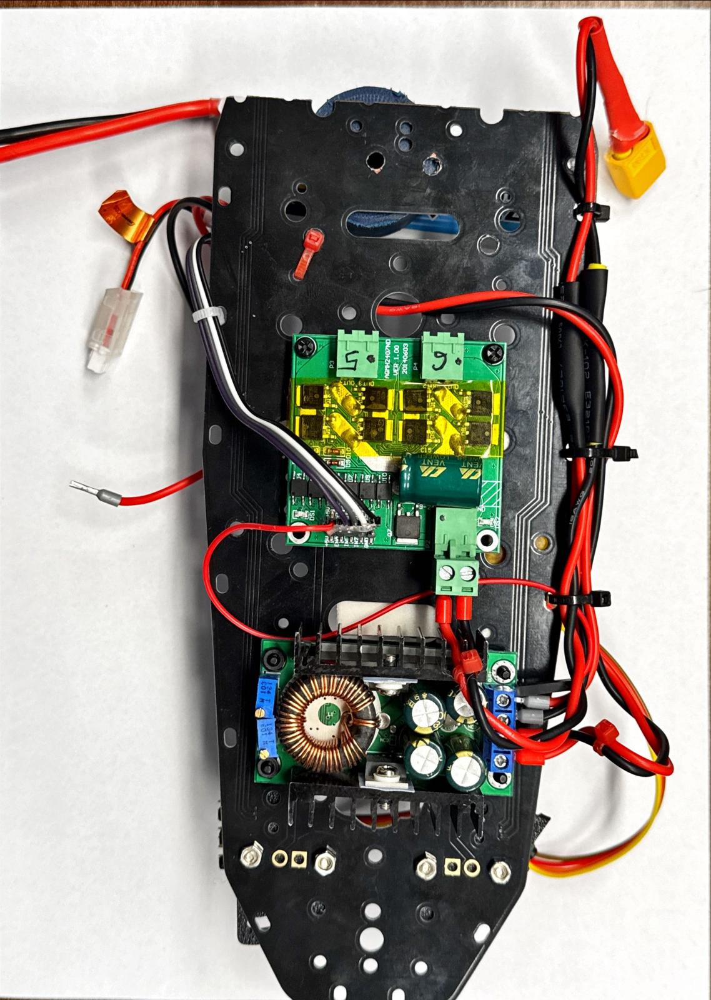

# WRO_003_Robotics

# Table of contents
# Meet the team
## Alex
## Cosmin
## Andrei
# Introduction

	Welcome to the engineering portfolio for our team's entry into the World Robot Olympiad (WRO) 2025 Future Engineers category. This document pre our journey in designing, building, and programming an autonomous vehicle to tackle the"Self-Driving Car Challenge." The prospect of this competition was both exciting and daunting. We knew that creating a car capable of navigating the course correctly and executing a perfect parallel park would be a great challenge.
	Our approach was shaped by some constraints, presented in the documentation. This portfolio details our entire engineering process, from the initial brainstorming sessions and chassis choice to the integration of our hardware.
	As you'll see in our system architecture diagrams, we chose a Raspberry Pi 4B as the central brain, interfacing it with a camera for computer vision, an IMU for orientation, and distance sensors for precise navigation. The development of our control logic, illustrated in our software flowcharts, was a significant challenge, requiring us to translate complex rules into robust, efficient code that could react in real-time.

	We embraced the WRO's emphasis on thorough documentation, and we hope this portfolio clearly communicates our passion, our process, and our commitment to growing as future engineers.
	We really wish to continue thoroughly docummenting our projects in the future.
# Considered constraints
	Our design and development process was guided by the official WRO 2025 Future Engineers rules. The most critical constraints that shaped our vehicle are:

- **Dimensions & Weight**: The vehicle must not exceed **300 mm x 200 mm x 300 mm** (Length x Width x Height) and a maximum weight of **1.5 kg**.
    
- **Drive System**: The vehicle must be a **4-wheeled vehicle** with one driving axle and one steering actuator. Critically, differential wheeled robots
    
- **Control System**: The vehicle must be **fully autonomous** during a run, with no wireless communication of any kind. Closed loop control must be implemented to ensure proper functionality
    
- **Startup Procedure**: The vehicle must be switched on with a single switch and then wait for a single start button press to begin its run.
- 
- **Perception**: The vehicle must be able to detect the walls of the field and track the position of green and red obstacles. The parking spot should also be properly detected.
- 
- **Documentation**: A significant portion of the score comes from comprehensive documentation, including an engineering journal and a public GitHub repository with commented code and commit history.
# Vehicle description
	The design is based on a heavily modified prebuilt RC car. Necessary modifications were made. Sensing and control capabilities were added.
## Starting point

## Mechanical
	Having a solid starting point was essential for us. We used a prebuilt RC car chasis which was available. It was designed for very high speed, off-road capabilities and was also over the size constraints, so we made some modifications:
- Conversion to rear wheel drive (from 4WD) - the Ackermann steering approximation can cause slippage when high steering angles are necessary 
- new motor - high gear ration makes the car slow and easily controllable. The encoder on the motor gives us the possibility of velocity control.
- new servomotor - the motor has a small movement angle, to get better steering „precision”
- new structure for mounting electronics 
### Kinematics

In accordance with the competition rules, our vehicle utilizes a car-like steering system. Its motion is modeled using bicycle kinematics, which simplifies the complex dynamics of a four-wheeled vehicle into a model with a single front and rear wheel. This approach is effective for planning paths and controlling turns at the speeds required for this competition.
- ![[Pasted image 20250611100528.png]]

The key parameters of this model, as shown in the diagram, are:

- **L**: The wheelbase length, which is the distance between the front and rear axles. For our vehicle, L is 250mm.
- **δ (delta)**: The steering angle of the front wheel relative to the car's chassis. Our mechanical system allows for a maximum steering angle of about 25 degrees.
- **θ (theta)**: The orientation or heading angle of the vehicle, measured with respect to a fixed global coordinate frame.
- **ICR**: The Instantaneous Center of Rotation. This is the point around which the entire vehicle rotates at a given moment. The vehicle turns by rotating around this point.
- **R**: The turning radius, defined as the distance from the ICR to the center of the rear axle. mm
- **ω (omega)**: The yaw rate (θ dot ) radians/sec
- **(Xr, Yr)**: Position of the center of the vehicle's rear axle in a 2D plane.
- **v**: The linear velocity of the vehicle. mm/sec
### geometry
The geometry had to be modified:
- the shock absorbers were changed for rigid 3D printed linkages. Suspension was not needed for the current application and would introduce unwanted noise in the system. Additionally, the car was originally very close to the 200mm width limit, so we made it narrower by raising the suspension.
- proper alignment of the tires was ensured 
## Electronics

### Power management
The robot  powered by a 2S 2200 mAh **LiPo**. The battery output is regulated by a DC-DC converter, which supplies a stable 5V voltage to the Raspberry Pi SBPC.
The same battery also powers a DC motor driver that controls a single drive motor. This driver receives control signals directly from the Raspberry Pi, enabling the robot to move forward and backward. In addition, the Raspberry Pi controls a servo motor responsible for steering, allowing the robot to navigate its environment





### Sensor management


- A raspberry pi camera 2 wide is used because:
	- It was already available to us
	- Ease of use
	- Good viewing angle
	- Low distortion
	- previous experience
	- small, compact size
	- Link : https://www.raspberrypi.com/products/camera-module-v2/
- 
- two Time-of-Flight (ToF) 8x8 multizone ranging sensor with 90 degrees FoV where used because:
	- They were already available to us
	- They are an alternative to a LIDAR sensor, however:
		- cheaper
		- higher sampling rate
		- it has 2D capabilities (compared to a spinning LIDAR)
		- Link : https://www.st.com/en/imaging-and-photonics-solutions/vl53l7cx.html
- Motor encoder: a two-channel hall effect encoder, preinstalled on the back of the motor was used because:
	- It was already installed
	- It allows for velocity control
	- It allows for calculation of displacement
	- Link: [Pololu - 12V Motor with 64 CPR Encoder for 37D mm Metal Gearmotors (No Gearbox, Helical Pinion)](https://www.pololu.com/product/4750)
- MPU 6050 IMU was used because:
	- It was already available
	- We found an easy to use RPI Python library
	- It allows for future development of advanced positioning algorithms
#
## Software
Pentru ca o mașină să se poată conduce singură, trebuie luate în considerare două aspecte esențiale: **hardware-ul** și **software-ul**. Partea de hardware este dezvoltată de colegii mei, iar de partea de software mă ocup eu.

Algoritmul este cel care "inteligentizează" fiecare dispozitiv. Să descriem codul în detaliu:

1.  **Alegerea limbajului de programare (Python)**: Am optat pentru **Python** datorită ușurinței sale de înțelegere, logicii simple și comunității extinse, care facilitează colaborarea în echipă și crește nivelul de abstractizare, chiar dacă personal aș fi preferat C/C++.
2.  **Alegerea bibliotecii de procesare a imaginilor (OpenCV)**: Pentru procesarea vizuală, vom folosi **OpenCV**. Aceasta este o bibliotecă recunoscută, cu o comunitate vastă, fiind, de asemenea, *cross-platform* (compatibilă cu multiple limbaje de programare precum C++, Python, Java etc.).

Algoritmul pe care îl vom crea este unul simplu, care preia informații de la cameră - s - a folosit camera wide Picamera. Exista suport pentru utilizarea acesteia cu Raspberry Pi. (am folosit Pi4B, 4 GB)
---

### Mobility Management
### Obstacle Management

Vom începe cu explicarea algoritmului pentru cameră:

Primul pas este **importarea bibliotecilor** necesare. O bibliotecă este o colecție de cod pre-scris care oferă funcționalități specifice, accelerând procesul de dezvoltare și simplificând complexitatea anumitor operațiuni.

```python
import cv2
import numpy as np
from picamera2 import Picamera2
```

**Descrierea bibliotecilor:**

* **`cv2` (OpenCV)**: Utilizată pentru procesarea imaginilor și viziune computerizată.
* **`numpy` (Numerical Python)**: O bibliotecă fundamentală pentru calcule științifice și operații cu array-uri multidimensionale.
* **`Picamera2`**: O versiune nouă a bibliotecii pentru controlul camerelor video de la Raspberry Pi.

```python
hsv = cv2.cvtColor(frame, cv2.COLOR_BGR2HSV)
```

**Transformarea imaginii în spațiul de culoare HSV:** Această linie de cod convertește imaginea primită (presupusă a fi în format BGR - Blue, Green, Red) în spațiul de culoare HSV (Hue, Saturation, Value). Conversia în HSV este adesea preferată pentru detecția culorilor, deoarece separă informația de luminozitate (Value) de cea de culoare (Hue și Saturation), făcând detecția mai robustă la variațiile de iluminare.

```python
lowerRed1 = np.array([0, 120, 70])
upperRed1 = np.array([10, 255, 255])
lowerRed2 = np.array([170, 120, 70])
upperRed2 = np.array([180, 255, 255])
```

**Definirea intervalelor de culoare pentru roșu:** Am definit două intervale de culori pentru roșu (deoarece roșul se află la ambele capete ale spectrului de culori în spațiul HSV). Aceste intervale vor fi utilizate pentru a crea o mască, izolând pixelii care corespund acestor culori.

```python
maskRed1 = cv2.inRange(hsv, lowerRed1, upperRed1)
maskRed2 = cv2.inRange(hsv, lowerRed2, upperRed2)
redMask = cv2.bitwise_or(maskRed1, maskRed2)
```

**Crearea măștii pentru culoarea roșie:** Aceste linii aplică un filtru pe imaginea HSV și returnează o mască binară (`redMask`). Pixelii din mască vor fi albi (255) acolo unde culoarea se încadrează în intervalele de roșu definite, și negri (0) în caz contrar. Prin combinarea (`bitwise_or`) celor două măști se obține masca finală pentru roșu.

```python
lowerGreen = np.array([35, 50, 50])
upperGreen = np.array([85, 255, 255])
greenMask = cv2.inRange(hsv, lowerGreen, upperGreen)
```

**Crearea măștii pentru culoarea verde:** Similar cu roșu, definim un interval de culoare pentru verde și creăm masca corespunzătoare (`greenMask`).

```python
kernel = np.ones((4,4), np.uint8)
redMask = cv2.erode(redMask, kernel, iterations=3)
greenMask = cv2.erode(greenMask, kernel, iterations=3)
```

**Erodarea măștilor:** Aplicăm o operație de **eroziune** măștilor roșie și verde. Aceasta ajută la eliminarea zgomotului, a pixelilor izolați și la separarea obiectelor care ar putea fi conectate. Parametrul `kernel` definește forma și dimensiunea elementului de structurare, iar `iterations` controlează de câte ori se aplică operația.

```python
redContours, _ = cv2.findContours(redMask, cv2.RETR_EXTERNAL, cv2.CHAIN_APPROX_SIMPLE)
largestRed = None
maxRedArea = 0

for cnt in redContours:
    area = cv2.contourArea(cnt)
    if area > maxRedArea and area > 100:
        maxRedArea = area
        largestRed = cnt
```

**Detectarea contururilor roșii și găsirea celui mai mare obiect roșu:** Aici se detectează contururile (adică granițele) obiectelor din masca roșie. Apoi, se iterează prin aceste contururi pentru a identifica pe cel cu cea mai mare arie (suprafață), reprezentând cel mai mare obiect roșu detectat. Pragul de `100` pixeli este folosit pentru a filtra contururile mici, considerate zgomot.

```python
greenContours, _ = cv2.findContours(greenMask, cv2.RETR_EXTERNAL, cv2.CHAIN_APPROX_SIMPLE)
largestGreen = None
maxGreenArea = 0
for cnt in greenContours:
    area = cv2.contourArea(cnt)
    if area > maxGreenArea and area > 100:
        maxGreenArea = area
        largestGreen = cnt
```

**Detectarea contururilor verzi și găsirea celui mai mare obiect verde:** Similar cu roșu, se detectează contururile obiectelor din masca verde și se identifică cel mai mare obiect verde.

```python
largestObject = None
objectColor = None
if largestRed is not None and largestGreen is not None:
    if maxRedArea > maxGreenArea:
        largestObject = largestRed
        objectColor = "red"
    else:
        largestObject = largestGreen
        objectColor = "green"
elif largestRed is not None:
    largestObject = largestRed
    objectColor = "red"
elif largestGreen is not None:
    largestObject = largestGreen
    objectColor = "green"
```

**Determinarea celui mai mare obiect detectat:** Această secțiune compară ariile celui mai mare obiect roșu și celui mai mare obiect verde. Dacă ambele culori sunt prezente, se alege obiectul cu aria cea mai mare. Dacă doar una dintre culori este prezentă, se alege obiectul corespunzător. Variabilele `largestObject` și `objectColor` vor stoca informațiile despre obiectul dominant.

```python
redPixels = cv2.countNonZero(redMask)
greenPixels = cv2.countNonZero(greenMask)
totalPixels = frame.shape[0] * frame.shape[1]
```

**Calculul numărului de pixeli pentru fiecare culoare:** Aici se numără pixelii non-zero (adică pixelii albi, care reprezintă culoarea detectată) din fiecare mască. De asemenea, se calculează numărul total de pixeli din imagine.

```python
redPercentage = (redPixels / totalPixels) * 100
greenPercentage = (greenPixels / totalPixels) * 100
```

**Calculul procentajului de pixeli:** Se calculează procentajul de pixeli roșii și verzi din întreaga imagine, oferind o măsură a prevalenței fiecărei culori.

```python
return redMask, greenMask, redPercentage, greenPercentage, largestObject, objectColor
```

**Returnarea valorilor:** Funcția `detectColors` returnează măștile pentru roșu și verde, procentajele acestora, cel mai mare obiect detectat (dacă există) și culoarea acestuia.

```python
def main():
```

**Funcția principală `main`:** Aceasta este funcția de intrare a programului, unde se inițiază și se controlează fluxul principal de execuție.

```python
picam2 = Picamera2()
```

**Inițializarea camerei:** Se creează o instanță a clasei `Picamera2` pentru a interacționa cu camera Raspberry Pi.

```python
config = picam2.create_preview_configuration(main={"size": (640, 480)})
picam2.configure(config)
```

**Configurarea camerei:** Se configurează camera pentru a capta imagini la o rezoluție de `640x480` pixeli, adecvată pentru previzualizare.

```python
picam2.start()
```

**Pornirea stream-ului camerei:** Se pornește captarea video de la cameră.

```python
try:
```

**Bloc `try`:** Acest bloc gestionează excepțiile care ar putea apărea în timpul execuției programului, asigurând o închidere curată a resurselor.

```python
while True:
```

**Bucla principală de procesare:** Această buclă rulează continuu, procesând fiecare cadru capturat de cameră.

```python
frame = picam2.capture_array()
frame = cv2.cvtColor(frame, cv2.COLOR_RGB2BGR)
displayFrame = frame.copy()
```

**Capturarea și pregătirea imaginii:** Se captează un cadru de la cameră, se convertește din formatul RGB (specific `Picamera2`) în BGR (specific OpenCV) și se creează o copie a cadrului pentru a fi afișată, fără a modifica imaginea originală.

```python
redMask, greenMask, redPerc, greenPerc, largestObj, objColor = detectColors(frame)
```

**Apelarea funcției de detecție a culorilor:** Se apelează funcția `detectColors` cu cadrul curent pentru a obține măștile, procentajele și informațiile despre cel mai mare obiect detectat.

```python
if largestObj is not None:
    x,y,w,h = cv2.boundingRect(largestObj)
    if objColor == "red":
        color = (0, 0, 255)  # Red
        label = f"Largest Red: {cv2.contourArea(largestObj):.0f}px"
    else:
        color = (0, 255, 0)  # Green
        label = f"Largest Green: {cv2.contourArea(largestObj):.0f}px"
```

**Desenarea dreptunghiului de încadrare și a etichetei:** Dacă a fost detectat un obiect dominant (`largestObj` nu este `None`), se calculează coordonatele dreptunghiului de încadrare al acestuia. Apoi, se definesc culoarea și eticheta care vor fi folosite pentru a desena dreptunghiul și textul pe imaginea de afișat, indicând culoarea și aria obiectului.

```python
cv2.rectangle(displayFrame, (x,y), (x+w,y+h), color, 3)
cv2.putText(displayFrame, label, (x,y-10), cv2.FONT_HERSHEY_SIMPLEX, 0.7, color, 2)
```

**Afișarea vizualizărilor:** Se desenează dreptunghiul de încadrare și textul etichetei pe imaginea destinată afișării.

```python
redDisplay = cv2.cvtColor(redMask, cv2.COLOR_GRAY2BGR)
greenDisplay = cv2.cvtColor(greenMask, cv2.COLOR_GRAY2BGR)
```

**Pregătirea măștilor pentru afișare:** Măștile binare (care sunt imagini pe un singur canal, gri) sunt convertite în imagini BGR cu 3 canale, pentru a putea fi afișate alături de cadrul original.

```python
topRow = np.hstack((displayFrame, redDisplay))
bottomRow = np.hstack((greenDisplay, np.zeros_like(frame)))
combined = np.vstack((topRow, bottomRow))
```

**Combinarea imaginilor pentru afișare:** Imaginile sunt combinate orizontal (`hstack`) și vertical (`vstack`) pentru a crea o singură fereastră de afișare care să conțină cadrul original cu detecția obiectului, masca roșie și masca verde. `np.zeros_like(frame)` creează o imagine neagră de aceeași dimensiune cu cadrul original, folosită pentru a umple spațiul rămas liber.

```python
cv2.putText(combined, "Original (Largest Object)", (10, 30),
    cv2.FONT_HERSHEY_SIMPLEX, 0.7, (255,255,255), 2)
cv2.putText(combined, "Red Mask", (650, 30),
    cv2.FONT_HERSHEY_SIMPLEX, 0.7, (0,0,255), 2)
cv2.putText(combined, "Green Mask", (10, 510),
    cv2.FONT_HERSHEY_SIMPLEX, 0.7, (0,255,0), 2)
```

**Adăugarea etichetelor text pe imaginile combinate:** Se adaugă etichete text pe imaginea combinată pentru a identifica fiecare secțiune (cadru original, mască roșie, mască verde).

```python
cv2.imshow("Largest Object Detection", combined)
```

**Afișarea ferestrei:** Se afișează fereastra cu imaginile combinate.

```python
if objColor == "red" and redPerc > 5:
    print("Right")
elif objColor == "green" and greenPerc > 5:
    print("Left")
else:
    print("Just GO")
```

**Logica de decizie a mișcării:** Această secțiune implementează o logică simplă de decizie bazată pe culoarea obiectului dominant și procentajul de pixeli. Dacă un obiect roșu dominant depășește un anumit prag, se sugerează o mișcare "Right" (dreapta); dacă un obiect verde dominant depășește pragul, se sugerează "Left" (stânga). În caz contrar, mașina ar trebui să "Just GO" (să meargă înainte).

```python
if cv2.waitKey(1) & 0xFF == ord('q'):
    break
```

**Controlul buclei și închiderea:** Se așteaptă o tastă timp de 1 milisecundă. Dacă tasta apăsată este 'q', bucla se întrerupe, încheind programul.

```python
finally:
    picam2.stop()
    cv2.destroyAllWindows()
```

**Bloc `finally`:** Acest bloc se execută întotdeauna, indiferent dacă a apărut o excepție sau nu. Este folosit pentru a opri stream-ul camerei și a închide toate ferestrele OpenCV, asigurând eliberarea resurselor.

```python
if __name__ == "__main__":
    main()
```

**Punctul de intrare al programului:** Această construcție standard Python asigură că funcția `main()` este apelată doar atunci când scriptul este executat direct (nu când este importat ca modul).
